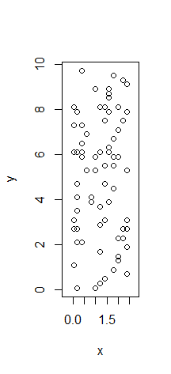

```{r setup, include=FALSE}
knitr::opts_chunk$set(echo = TRUE)
```

# Useful packages:
```{r message = FALSE}
library(devtools)
install_github("sdray/adespatial", ref = "david")
library(adespatial)
library(spdep)
library(vegan)
```

# Objective of this document

This document is an appendix of the paper entitled *Testing and interpreting the joint space-environment fraction in variation partitioning analyses of ecological data*, by Bauman D., Vleminckx J., Drouet T. and Hardy O.. It provides a tutorial to illustrate the test of the joint space-environment fraction of a variation partitioning (JSEF, or fraction [b]), using the function `envspace.test` of the `adespatial` package. The information presented in this tutorial is detailed in the help document of the above-mentioned function.

The oribatid mite data will be used as an example (Borcard et al. 1992, 1994 for details on the dataset).

# Concept of the method

For a variation partitioning (VP) of a response variable or matrix (`Y`) against an environmental component (`env`) and a spatial component (spatial eigenvectors, or MEM variables; Borcard and Legendre 2002, Dray et al. 2006).

The adjusted R2 (Peres-Neto et al. 2006; R2adj) of the JSEF is not an actual R2, as it is computed by subtracting the R2 of other fractions (adjusted following Peres-Neto et al. 2006) of the VP and therefore has zero degree of freedom. The JSEF can therefore not be tested in the classical way (permutation of the model residuals). 
The function `envspace.test` provides two ways of testing this fraction using constrained null models: a torus-translation (or torus randomisation, Upton and Fingleton 1985) test (TT), for regular sampling designs only, and Moran spectral randomization (MSR, Wagner and Dray 2015), for any kind of sampling design. 
The function first checks whether both the environment and the response data display a significant spatial structure, and whether the response data is significantly related to the environment. Then, the function proceeds to the test of the JSEF if and only if those three conditions are fulfilled.

For more details:
```{r eval = FALSE}
help(envspace.test)
```

## Data input

Input of the community data (`Y`) and Hellinger-transformation to prepare the data for the redundancy analyses of the VP (see Legendre and Gallagher 2001):
```{r}
data(mite)
Y <- decostand(mite, method = "hellinger")
dim(Y)
```

Environmental explanatory dataset (here, we only use the two quantitative variables, i.e., the subtrate density and water content of the substrate):
```{r}
data(mite.env)
env <- mite.env[, 1:2]
dim(env)
```

Coordinates of the 70 sites:
```{r}
data(mite.xy)
coord <- mite.xy
```


## Generation of MEM variables

Spatial eigenvectors (MEM variables) need to be constructed separately for `Y` and `env`, as the spatial weighting matrix (**W** matrix) allowing an optimal detection of the spatial patterns of `Y` and `env` may not be the same. 

The MEM variables generated for `env` will allow 1) testing for a spatial structure in `env` (preliminary condition for testing the JSEF), and 2) using MSR in the test of the JSEF of the VP. 
The MEM variables generated on the basis of `Y` will allow 1) testing for a spatial structure in `Y` (preliminary condition for testing the JSEF), and 2) will be used as the spatial component of the VP.

### Optimisation of a **W** matrix for `Y` and `env`:

The optimisation is performed in two steps: generating a list of the candidate **W** matrices that will be compared, then testing all candidates and retaining the one yielding the maximum coefficient of determination while correcting for the significance threshold according to the number of candidates tested (R2; see help files of the functions `listw.candidates` and `MEM.modsel`, proposed by Bauman et al. 2018a).

We create five candidate **W** matrices: a connectivity matrix based on a Gabriel graphs, and on a minimum spanning tree (i.e., two contrasted graph-based **W** matrices), either with no weights on the connexions, or weighted by a function decreasing linearly with the distance. We also add a distance-based **W** matrix corresponding to the connectivity and weighting criteria of the original PCNM method:
```{r message = FALSE, warning = FALSE}
candidates <- listw.candidates(coord, del = FALSE, gab = TRUE, rel = FALSE,
                               mst = TRUE, DB = FALSE, PCNM = TRUE, 
                               binary = TRUE, flin = TRUE, fconcdown = FALSE,
                               fconcup = FALSE)
```
Optimisation of the choice of the **W** matrices:
For `Y`:
```{r results = 'hide'}
modsel_Y <- MEM.modsel(Y, candidates, correction = TRUE, autocor = "positive")
```

```{r echo = FALSE}
cat("A best MEM model was detected.", "\n",
    "The best W matrix for 'Y' was ", modsel_Y$best$name, ". The forward selection ",
    "with double stopping", "\n", "criterion (Blanchet et al. 2008) selected a best subset",
    " of spatial predictors within", "\n", "this W matrix. This subset of ", 
    modsel_Y$best$NbVar, " MEM variables has an adjusted R2 of ", 
    round(modsel_Y$best$R2adj, 3), ".", sep = "")
```

For `env`:
```{r results = 'hide'}
modsel_env <- MEM.modsel(env, candidates, correction = TRUE, autocor = "all")
```

```{r echo = FALSE}
cat("A best MEM model was detected.", "\n",
    "The best W matrix for 'Y' was ", modsel_env$best$name, ". The forward selection ",
    "with double stopping", "\n", "criterion (Blanchet et al. 2008) selected a best subset",
    " of spatial predictors within", "\n", "this W matrix. This subset of ", 
    modsel_env$best$NbVar, " MEM variables has an adjusted R2 of ", 
    round(modsel_env$best$R2adj, 3), ".", sep = "")
```

## Variation partitioning and test of the JSEF

We partition the variation of `Y` into a environmental component and a spatial component. The latter contains a selection of spatial eigenvectors obtained by forward selection with double stopping criterion (Blanchet et al. 2008) of the complete set of eigenvectors (associated to positive eigenvalues) of the best **W** matrix selected by the optimisation procedure. Although there are several methods to select a subset of spatial predictors, it has recently been shown that the forward selection was the most powerful and accurate method and should therefore be prefered when the purpose is to accurately describe the multiscale spatial patterns of a response variable or matrix (see Bauman et al. 2018b).

```{r}
# Subset of selected MEM variables within the best W matrix:
MEM_Ab <- modsel_Y$best$MEM.select

VP <- varpart(Y, env, MEM_Ab)
plot(VP)
# JSEF:
(JSEF <- VP$part$indfract$Adj.R.square[2])
```

Test of the JSEF using `envspace.test`:
```{r}
JSEF.test <- envspace.test(E = env, Ab = Y, coord = coord, MEM_Ab = MEM_Ab,
                           listw_E = modsel_env$best$listw, scale = TRUE, regular = FALSE,
                           nMSR = 999)
# JSEF:
JSEF.test$R2adj
# Significance of the permutation test performed with MSR:
JSEF.test$pval_MSR
```

The JSEF value is therefore very unlikely to have been produced by chance, and we can proceed to the interpretation of this portion of variation of `Y` correlated to a spatially structured environment.

This fraction may consist in an induced spatial dependence, in the case in which the environmental variable causing [b] is among the variables measured and included in `env`. In this case, a spatial mapping of the structure in fraction [b] will indicate at what spatial scale does the environmental variable induce a structure in `Y`.

It is worth reminding that the purpose of VP is not to establish causal relations, so that the ecological interpretation of the results is always to be done with caution, considering the ecological relevance of the measured variables. This, however, remains true for all fractions of the VP.
It is also worth mentioning that part of an actual induced spatial dependence may still be in fraction [c] (i.e. the pure spatial component), in the case where the variable responsible for a pattern in `Y` has not been accounted for. 

## References

Upton G.J.G., Fingleton B. (1985). Spatial data analysis by example. Vol. 1: Point pattern and quantitative data. Wiley, NewYork.

Borcard D., Legendre P., Drapeau P. (1992). Partialling out the spatial component of ecological variation. Ecology, 73(3), 1045-1055.

Borcard D., Legendre P. (1994). Environmental control and spatial structure in ecological communities: an example using oribatid mites (Acari, Oribatei). Environmental and Ecological Statistics, 1(1), 37-61.

Legendre P., Gallagher E.D. (2001) Ecologically meaningful transformations for ordination of species data. Oecologia, 129(2), 271-280.

Borcard D. and Legendre P. (2002) All-scale spatial analysis of ecological data by means of principal coordinates of neighbour matrices. Ecological Modelling, 153, 51-68.

Dray S., Legendre P., Peres-Neto P.R. (2006) Spatial modeling: a comprehensive framework for principal coordinate analysis of neighbor matrices (PCNM). Ecological Modelling, 196, 483-493.
 
Peres-Neto P., Legendre P., Dray S., Borcard D. (2006) Variation partitioning of species data matrices: estimation and comparison of fractions. Ecology, 87(10), 2614-2625.

Blanchet G., Legendre P. and Borcard D. (2008) Forward selection of explanatory variables. Ecology, 89(9), 2623-2632.

Bauman D., Fortin M-J, Drouet T. and Dray S. (2018a) To link or not to link: optimising the choice of a spatial weighting matrix in eigenvector-based methods. Ecology, under review.
 
Bauman D., Drouet T., Dray S. and Vleminckx J. (2018b) Disentangling good from bad practices in the selection of spatial or phylogenetic eigenvectors. Ecography, 41, 1-12.

Wagner H., Dray S. (2015). Generating spatially constrained null models for irregularly spaced data using Moran spectral randomization methods. Methods in Ecology and Evolution, 6, 1169-1178.
